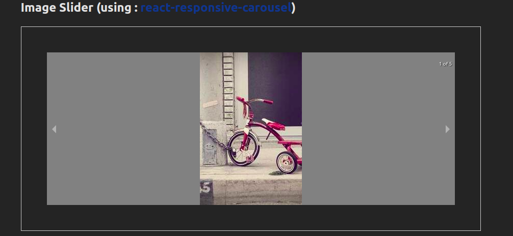

# Image Combiner

Combine two images on upload from system and return as a single file and also download.

### Screenshot 1 :

### Screenshot 2 :

### Screenshot 3 :

# Image Magnifier

Magnifying image on mouse hover .

### Screenshot 1 :

# Image Slider

Slider view for images , video (play at once) and blob URL's for uploaded media from system using npm : <a href='https://www.npmjs.com/package/react-responsive-carousel'>react-responsive-carousel</a>

### Screenshot 1 :

**_Thanks for checkout_**
